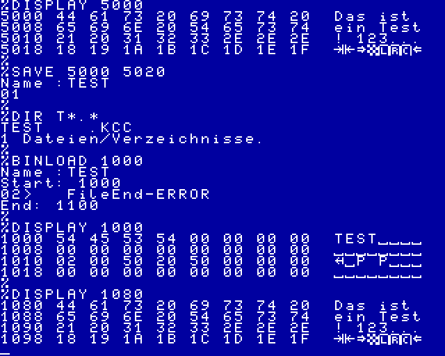

# BINLOAD - Binärdateien laden

Die im CAOS enthaltenen Laderoutinen erwarten immer einen Vorblock.
Mit BINLOAD gibt es die Möglichkeit beliebige Dateien - auch ohne Vorblock - direkt in den Speicher zu laden.

Wird keine Ladeadresse angegeben, wird 04000h als Standard verwendet.  
Wird keine Endadresse angegeben, wird 0E000h als Standard verwendet.  
Es wird gelesen, bis der Block mit der Endadresse erreicht ist oder bis zum Dateiende.

## Aufruf

- ohne Parameter:  
 `%BINLOAD`

- mit einem Parameter:  
 `%BINLOAD Ladeadresse`

- mit zwei Parametern:  
 `%BINLOAD Ladeadresse Endadresse`

## Test und Beispielaufruf

Der Speicherbreich von 5000-5020 wird als TEST.KCC gespeichert.
Beim Speichern erhält die Datei automatisch einen CAOS-Vorblock.

Nach dem Einlesen mit BINLOAD, kann der komplette Dateiinhalt eingesehen werden.
Der Vorblock befindet sich im Beispiel an Adresse 1000h.
Die eigentlichen Nutzdaten sind ab Adresse 1080h abgelegt.
