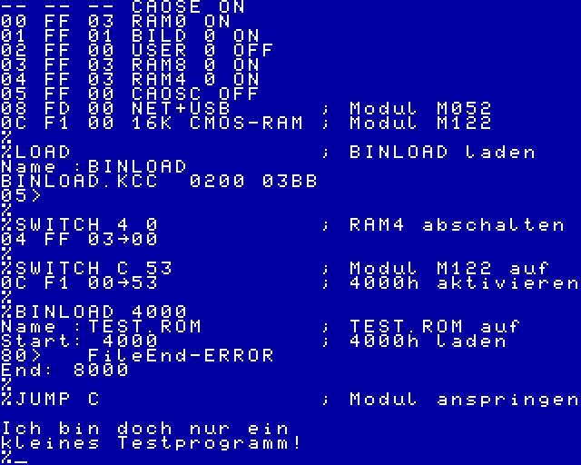

# `JUMP_Start_16k`

Mit diesem Programm läßt sich eine KCC (bzw. KCB)-Datei in ein startfähiges ROM umwandeln.
Geeignet für die Kleincomputer KC85/3, KC85/4 und KC85/5.

Der Start im KC85 erfolgt mit

    `%JUMP <Modulschacht>`

Es wird ein ROM- bzw. EPROM-Modul mit 16 kByte Segmenten benötigt.  
Folgende Module sind geeignet (Auswahl):

- M028  16k EPROM
- M040  USER PROM 16K
- M048  256k segmented ROM

> [!WARNING]
> Limitierung der Programmgröße auf 16 kByte,
abzüglich des Hilfsprogrammes (<80 Bytes).

Die erzeugte ROM-Datei muß im letzten Segement gespeichert werden, damit JUMP funktioniert.

## Programmaufruf
```
./JUMP_Start_16k [-o|-v] <KCC-Datei> <ROM-Datei>
```
Programmptionen:  
-o   evtl. vorhandene ROM-Datei überschreiben  
-v   Programmversion ausgeben  

## Beispielaufruf

```
./JUMP_Start_16k BOULDER1.KCC BOULDER1.ROM

Lese KCC-Datei: BOULDER1.KCC
Größe: 16000 Bytes

Header-Informationen
Name:           boulder.kcc
# Adressen:     3
Anfangsadr.:    0300h
Endeadr(+1):    4100h
Startadr.:      1569h
Programmgröße:  15872 Bytes

ROM-Informationen
ROM-Größe: 16384 Bytes
verfügbar: 16323 Bytes

Erzeuge ROM-Datei: BOULDER1.ROM
Block 1: F03Dh...FFFFh
Block 2: C000h...EE3Ch
frei: 451 Bytes
```

## Test

Vor dem Brennen der EPROMs kann ein Test mit einem RAM-Modul erfolgen.  
Folgende Module mit 16k-Segmenten sind dafür geeignet:

- M011  64 K BYTE RAM
- M022  EXPANDER-RAM
- M122  16 kB CMOS RAM

Der erzeugte EPROM-Inhalt wird dazu in den Modulspeicher geladen.
Das kann z.B. mit [BINLOAD](../BINLOAD) erfolgen.

Der Start erfolgt auch hier mit

    `%JUMP <Modulschacht>`



