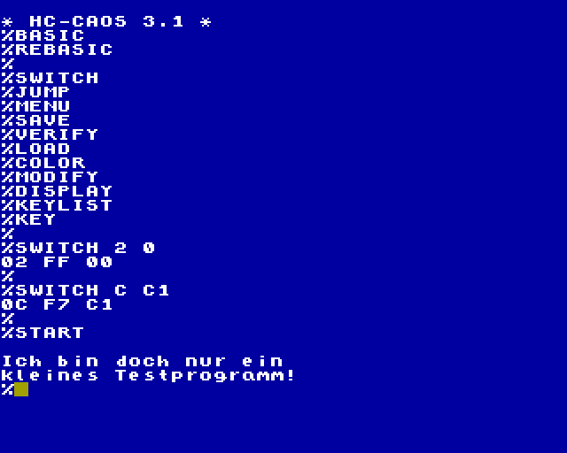

# `MENU_Start`

Mit diesem Programm läßt sich eine KCC (bzw. KCB)-Datei in ein startfähiges ROM umwandeln.
Geeignet für die Kleincomputer KC85/3, KC85/4 und KC85/5.

Der Start im KC85 erfolgt mit

    `%SWITCH <Modulschacht> C1`

    und

    `%START`

> [!WARNING]
> Beim KC85/3 muß erst der BASIC-ROM deaktiviert werden:
> `%SWITCH 2 0`

Es wird ein ROM- bzw. EPROM-Modul mit 8 oder 16 kByte Segmenten benötigt.  
Folgende 8 kByte-Module sind geeignet (Auswahl):

- M025  USER PROM 8K
- M045  32k segmented ROM
- M046  64k segmented ROM
- M047  128k segmented ROM
- M062  32k/64k seg. RAM/ROM
- M125  USER PROM 8K/16K/64K

Die folgenden 16 kByte-Module sind geeignet (Auswahl):
- M028  16k EPROM
- M040  USER PROM 16K
- M048  256k segmented ROM

> [!WARNING]
> Limitierung der Programmgröße auf 8 oder 16 kByte,
abzüglich des Hilfsprogrammes (ca. 100 Bytes).

Die erzeugte ROM-Datei belegt ein Segement.
Falls das Modul mehrere Speichersegmente unterstützt, können unterschiedliche Programme in unterschiedlichen Segementen gespeichert werden.
Die Auswahl des jeweiligen Segments erfolgt beim Kommando `%SWITCH`.

## Programmaufruf
```
./MENU_Start [-o|-v] [-m MENUWORT] -s <Segmentgröße> <KCC-Datei> <ROM-Datei>
```
Programmptionen:  
-s n Segmentgröße n kByte, (n = 8 oder 16)  
-o   evtl. vorhandene ROM-Datei überschreiben  
-m   neues Menüwort angeben (Standard: START)  
-v   Programmversion ausgeben  

## Beispielaufruf

```
./MENU_Start -s 16 FADEN91.KCC FADEN91.ROM                                      

Lese KCC-Datei: FADEN91.KCC
Größe: 15616 Bytes

Header-Informationen
Name:           >.G:.@ 2.@ 
# Adressen:     2
Anfangsadr.:    0800h
Endeadr(+1):    4450h
HINWEIS: Keine Startadresse hinterlegt, Program wird nur in den RAM geladen und nicht automatisch gestartet.
Programmgröße:  15440 Bytes
Menüeinträge:
 1: FADEN      -> 4382h

ROM-Informationen
ROM-Größe: 16384 Bytes
Hilfsprog: 98 Bytes
verfügbar: 16286 Bytes

Erzeuge ROM-Datei: FADEN91.ROM
Block 1: C062h...FCB1h
Menüwort: START
frei: 846 Bytes
```

## Test

Vor dem Brennen der EPROMs kann ein Test mit einem RAM-Modul erfolgen.  
Für den Test mit 8 kByte sind folgende Module geeignet:

- M062  32k/64k seg. RAM/ROM (mit RAM bestückt)
- M120  8 kB CMOS RAM

Für den Test mit 16 kByte sind folgende Module geeignet:

- M011  64 K BYTE RAM
- M022  EXPANDER-RAM
- M122  16 kB CMOS RAM

Der erzeugte EPROM-Inhalt wird dazu in den Modulspeicher geladen.
Das kann z.B. mit [BINLOAD](../BINLOAD) erfolgen.

Der Start erfolgt auch hier mit

    `%SWITCH <Modulschacht> C1`
    `%START`



