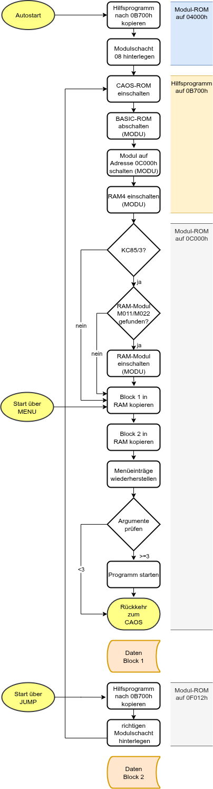

# `MULTI_Start`

Mit diesem Programm läßt sich eine KCC (bzw. KCB)-Datei in ein startfähiges ROM umwandeln.
Geeignet für die Kleincomputer KC85/3, KC85/4 und KC85/5.

Der Start im KC85 erfolgt automatisch, wenn das Modul im Schacht 8 gesteckt wird und das Strukturbyte 01h besizt.

Falls ein anderer Schacht genutzt wird oder das Modul nicht das Strukturbyte 01h hat, kann das Programm auch wie folgt gestartet werden:

    `%SWITCH <Modulschacht> C1`

    und

    `%START`

Der Start kann auch mit JUMP erfolgen:

    `%JUMP <Modulschacht>`

Es wird ein ROM- bzw. EPROM-Modul mit 8 oder 16 kByte Segmenten benötigt.  
Folgende 8 kByte-Module sind geeignet (Auswahl):

- M025  USER PROM 8K
- M045  32k segmented ROM
- M046  64k segmented ROM
- M047  128k segmented ROM
- M062  32k/64k seg. RAM/ROM
- M125  USER PROM 8K/16K/64K

Die folgenden 16 kByte-Module sind geeignet (Auswahl):

- M028  16k EPROM
- M040  USER PROM 16K
- M048  256k segmented ROM

> [!WARNING]
> Um Autostart nutzen zu können, muß als Struktrubyte 01h eingestellt sein. Dies erfordert ggf. Hardwaremodifikationen oder passende Einstelung der Steckbrücken.

> [!WARNING]
> Limitierung der Programmgröße auf 8 bzw. 16 kByte,
abzüglich des Hilfsprogrammes (ca. 255 Bytes).


## Programmaufruf
```
./MULTI_Start [-o|-v] [-m MENUWORT] -s <Segmentgröße> <KCC-Datei> <ROM-Datei>
```
Programmptionen:  
-s n Segmentgröße n kByte, (n = 8 oder 16)  
-o   evtl. vorhandene ROM-Datei überschreiben  
-m   neues Menüwort angeben (Standard: START)  
-v   Programmversion ausgeben  

## Beispielaufruf

```
./MULTI_Start  -s 16  DELIRO.KCC  DELIRO.ROM

Lese KCC-Datei: DELIRO.KCC
Größe: 16000 Bytes

Header-Informationen
Name:           DELIRO     
# Adressen:     3
Anfangsadr.:    0200h
Endeadr(+1):    4000h
Startadr.:      2D00h
Programmgröße:  15872 Bytes
Menüeinträge:
 1: DELIRO     -> 31D3h

ROM-Informationen
ROM-Größe: 16384 Bytes
Hilfsprog: 255 Bytes
verfügbar: 16129 Bytes

Erzeuge ROM-Datei: DELIRO.ROM
Hilfprog 1: C000h...C0EAh
Block 1   : C0EBh...F011h
Hilfprog 2: F012h...F025h
Block 2   : F026h...FEFEh
Menüwort: START
frei: 257 Bytes
```

## Programmstruktur des Hilfsprogramms

Für einen Blick hinter die Kulissen ist hier die Programmstruktur des Hilfsprogrammes dargestellt:


