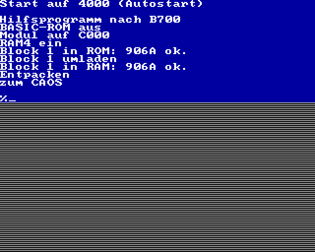

# `MULTI_Start_verbose`

> [!WARNING]
> Dieses Programm dient nur Diagnose- und Debuggingzwecken.

Mit diesem Programm läßt sich eine KCC (bzw. KCB)-Datei in ein startfähiges ROM umwandeln.
Geeignet für die Kleincomputer KC85/3, KC85/4 und KC85/5.

Das Programm wird komprimiert gespeichert.  
Der Kompressionsalgorithmus (ZX0 von Einar Saukas) schafft es die ursprüngliche Programmgröße auf 30 bis 60% zu reduzieren.

Das Laden im KC85 erfolgt automatisch (falls das Modul im Schacht 8 steckt und das Strukturbyte 01h ist).

Falls ein anderer Schacht genutzt wird oder das Modul nicht das Strukturbyte 01h hat, kann das Programm auch wie folgt geladen werden:

    `%SWITCH <Modulschacht> C1`

    und

    `%START`

Der Start kann auch mit JUMP erfolgen:

    `%JUMP <Modulschacht>`

Nach dem Kopieren in den RAM wird das Programm entpackt und gestartet.  
Dabei wird jeder Schritt auf dem Bildschirm kommentiert und eine kurze Pause eingelegt.  
Außerdem werden die Prüfsummen in ROM und RAM mit der originale Prüfsumme verglichen.  
Falls eine Prüfsumme nicht korrekt ist, werden weitere Schritte übersprungen.

Es wird ein ROM- bzw. EPROM-Modul mit 8 oder 16 kByte Segmenten benötigt.  
Folgende 8 kByte-Module sind geeignet (Auswahl):

- M025  USER PROM 8K
- M045  32k segmented ROM
- M046  64k segmented ROM
- M047  128k segmented ROM
- M062  32k/64k seg. RAM/ROM
- M125  USER PROM 8K/16K/64K

Die folgenden 16 kByte-Module sind geeignet (Auswahl):

- M028  16k EPROM
- M040  USER PROM 16K
- M048  256k segmented ROM

> [!WARNING]
> Um Autostart nutzen zu können, muß als Struktrubyte 01h eingestellt sein. Dies erfordert ggf. Hardwaremodifikationen oder passende Einstelung der Steckbrücken.

> [!WARNING]
> Limitierung der Programmgröße auf 8 bzw. 16 kByte,
abzüglich des Hilfsprogrammes (ca. 255 Bytes).


## Programmaufruf
```
./MULTI_Start_verbose [-o|-v] [-m MENUWORT] -s <Segmentgröße> <KCC-Datei> <ROM-Datei>
```
Programmptionen:  
-s n Segmentgröße n kByte, (n = 8 oder 16)  
-o   evtl. vorhandene ROM-Datei überschreiben  
-m   neues Menüwort angeben (Standard: START)  
-v   Programmversion ausgeben  

## Beispielaufruf

```

./MULTI_Start_verbose -s 16 -o main.kcc VERBOSE.ROM

Lese KCC-Datei: main.kcc
Größe: 20666 Bytes

Header-Informationen
Name:           SELECT10KCC
# Adressen:     3
Anfangsadr.:    0200h
Endeadr(+1):    523Ah
Startadr.:      0200h
Programmgröße:  20538 Bytes
Menüeinträge:
 1: SELECTION  -> 2B81h

Komprimiere (ZX0)
[...............................................]
Progamm (komprimiert): 9563
Kompressionsfaktor:    46.6%

ROM-Informationen
ROM-Größe:  16384 Bytes
Hilfsprog.: 978 Bytes
verfügbar:  15406 Bytes

Erzeuge ROM-Datei  VERBOSE.ROM
Hilfsprog. 1:  C000h...C3BDh
Block 1:       C3BEh...E918h
Prüfsumme 1:   906Ah
Hilfsprog. 2:  F012h...F025h
Block 2:       ungenutzt
Menüwort:      START
frei:          5843 Bytes
```

## Beispielausgabe

