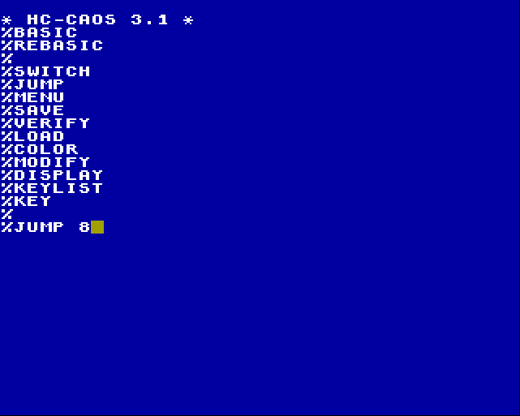

# Startfähige ROM/EPROM-Dateien für KC85 erstellen
Dieses Projekt enthält verschiedene Hilfsprogramme (für Linux und Windows), um startfähige ROM bzw. EPROM-Dateien zu erstellen.
Als Basis dient jeweils eine KCC-Datei [^1] oder eine KCB-Datei [^2].

Die jeweiligen Programm werden grundsätzlich in den RAM umkopiert und von dort gestartet.
ROM-fähige Programme (wie z.B. EDAS, FORTH oder WordPRO), die direkt ab Adresse 0C000h laufen, werden nicht unterstützt.

Es werden unterschiedliche Modultypen und verschiedene Startmethoden unterstützt:

| Modul                      | Struktur- byte | Segment- größe | Segmente | JUMP 8k | JUMP 16k | MENU 8k | MENU 16k | AUTO 8k | AUTO 16k
| :---                       | :---:             | :---:             | :---:    | :---:   | :---:    | :---:   | :---:    | :---:   | :---:
| M025  USER PROM 8K         | F7                |  8 kByte          | 1        | ja      | nein     | ja      | nein     | ja [^3] | nein
| M028  16 K EPROM           | F8                | 16 kByte          | 1        | nein    | ja       | nein    | ja       | nein    | ja [^3]
| M040  USER PROM 8k         | F7                |  8 kByte          | 1        | ja      | nein     | ja      | nein     | ja [^3] | nein
| M040  USER PROM 16k        | F8                | 16 kByte          | 1        | nein    | ja       | nein    | ja       | nein    | ja [^3]
| M045  32k segmented ROM    | 70/01             |  8 kByte          | 4        | ja      | nein     | ja      | nein     | ja [^4] | nein
| M046  64k segmented ROM    | 71/01             |  8 kByte          | 8        | ja      | nein     | ja      | nein     | ja [^4] | nein
| M047  128k segmented ROM   | 72/01             |  8 kByte          | 16       | ja      | nein     | ja      | nein     | ja [^4] | nein
| M048  256k segmented ROM   | 73                | 16 kByte          | 16       | nein    | ja       | nein    | ja       | nein    | ja [^3]
| M062  32k seg. RAM         | F3/01             |  8 kByte          | 4        | ja      | nein     | ja      | nein     | ja [^4] | nein
| M062  64k seg. RAM         | F3/01             |  8 kByte          | 8        | ja      | nein     | ja      | nein     | ja [^4] | nein
| M125  USER PROM 8K/16K/64K | unbek.            |  8 kByte          | 1-4      | ja      | nein     | ja      | nein     | ja [^3] | nein

## Startvarianten

### `JUMP_Start`
Start mittels JUMP

### `MENU_Start`
Start mittels MENU (bzw. Menüeintrag)

### `AUTO_Start`
Start mittels Autostart  
(nur im Modulschacht 8 mit Strukturbyte 01h)  

### `MULTI_Start`
Freie Wahl! Es werden alle bekannten Startmethoden unterstützt.

- Start mittels JUMP
- Start mittels MENU (bzw. Menüeintrag)
- Start mittels Autostart (Struktrubyte 01h, Schacht 08)

### `MULTI_Start_compressed`
Freie Wahl der Startmethode, wie bei `MULTI_Start`. Zusätzlich mit Kompression (ZX0)!  
Im Schnitt lassen sich die KC85-Programme auf 30 bis 60% ihrer ursprünglichen Größe reduzieren.  
Damit kann ggf. ein kleineres ERPOM verwendet werden.  
Das Entpacken im KC85 dauert selten länger als 0,5 Sekunden.

## Beispiele

### Start mit JUMP

### Start mit Menüeintrag

# Hilfsprogramme

## Binärdateien laden
siehe [BINLOAD](BINLOAD).

## KCC-Dateien überprüfen
siehe [check_KCC](check_KCC).

## Modulschächte
Im Bild ist für einen KC85 mit D002-Erweiterung die Zählung der Modulschächte dargestellt:

[^1]: CAOS Maschinenprogramm  
[^2]: BASIC-Programm, abgespeichert als Maschinenprogramm  
[^3]: erfordert Hardwaremodifikation für Strukturbyte 01h  
[^4]: erfordert Jumpereinstellung auf Strukturbyte 01h  
